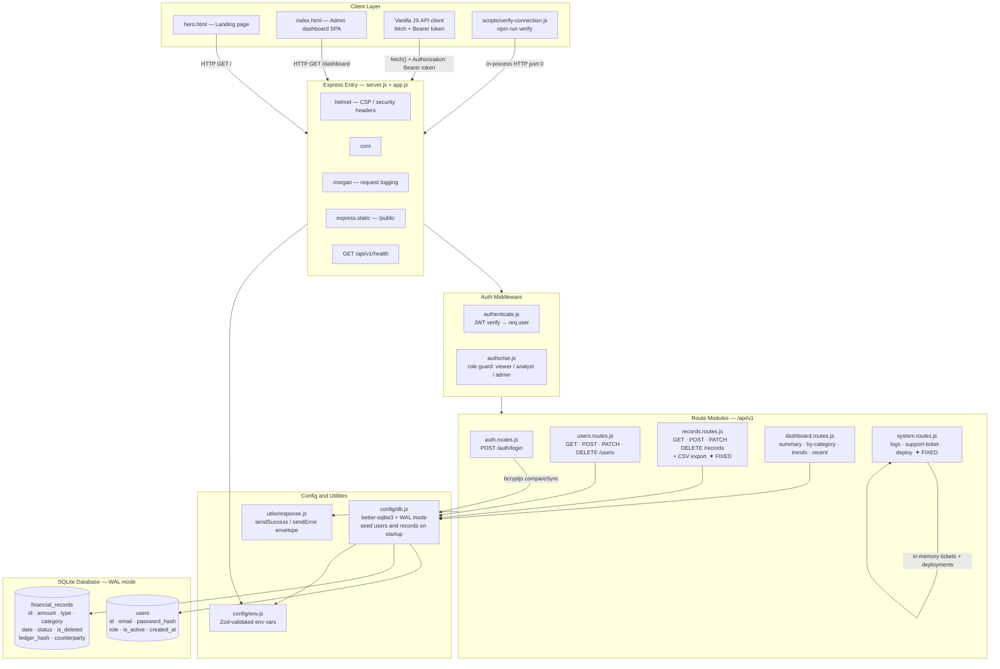

# Kinetic Ledger — Architecture

## System Architecture Diagram



---

## File Structure

```
kinetic-ledger/
├── .env.example                   # Environment variable template
├── .gitignore
├── package.json                   # Dependencies + npm scripts
├── ARCHITECTURE.md                # Architecture diagram + file structure (this file)
├── README.md
├── DESIGN.md
│
├── public/                        # Static frontend served by Express
│   ├── hero.html                  # Landing page                    ✦ FIXED
│   ├── index.html                 # Admin dashboard SPA             ✦ FIXED
│   └── favicon.svg
│
├── scripts/
│   ├── verify-connection.js       # npm run verify — smoke tests all endpoints
│   └── audit-functional.js
│
├── src/
│   ├── server.js                  # Entrypoint — app.listen()
│   ├── app.js                     # Express app, middleware chain, route mounting
│   │
│   ├── config/
│   │   ├── env.js                 # Zod env schema + fail-fast validation
│   │   └── db.js                  # SQLite init, schema creation, seed data
│   │
│   ├── middleware/
│   │   ├── authenticate.js        # JWT verify → attaches req.user
│   │   └── authorise.js           # Role-based access guard factory
│   │
│   ├── modules/
│   │   ├── auth/
│   │   │   └── auth.routes.js     # POST /login — bcrypt compare + JWT sign
│   │   ├── users/
│   │   │   └── users.routes.js    # CRUD users (admin-only write paths)
│   │   ├── records/
│   │   │   └── records.routes.js  # Financial records + CSV export  ✦ FIXED
│   │   ├── dashboard/
│   │   │   └── dashboard.routes.js  # summary · by-category · trends · recent
│   │   └── system/
│   │       └── system.routes.js   # logs · support-ticket · deploy  ✦ FIXED
│   │
│   └── utils/
│       └── response.js            # { success, data, error, meta } envelope
│
└── data/
    └── kinetic_ledger.db          # SQLite database (WAL mode, gitignored)
```

---

## Request Lifecycle

```
Browser / verify script
        │
        ▼
  Express (app.js)
  ├── helmet       → security headers (CSP, HSTS, etc.)
  ├── cors         → cross-origin policy
  ├── morgan       → dev request logging
  ├── express.json → parse JSON body
  │
  ├── /api/v1/auth/login  → NO auth required (public)
  │
  └── all other /api/v1/* routes:
        │
        ▼
    authenticate.js
    └── reads Authorization: Bearer <token>
    └── jwt.verify(token, JWT_SECRET) → req.user { id, role, email }
        │
        ▼
    authorise(["admin"]) or authorise(["viewer","analyst","admin"])
    └── checks req.user.role against allowed list
        │
        ▼
    Route handler
    └── better-sqlite3 prepared statements
    └── Zod input validation
    └── sendSuccess / sendError response
```

---

## RBAC Matrix

| Endpoint                        | viewer | analyst | admin |
|---------------------------------|--------|---------|-------|
| POST /auth/login                | ✓      | ✓       | ✓     |
| GET /users/me                   | ✓      | ✓       | ✓     |
| GET /users                      |        |         | ✓     |
| POST/PATCH/DELETE /users        |        |         | ✓     |
| GET /records (no filters)       | ✓      | ✓       | ✓     |
| GET /records (with filters/q)   |        | ✓       | ✓     |
| GET /records?format=csv         |        | ✓       | ✓     |
| POST/PATCH/DELETE /records      |        |         | ✓     |
| GET /dashboard/summary          | ✓      | ✓       | ✓     |
| GET /dashboard/recent           | ✓      | ✓       | ✓     |
| GET /dashboard/by-category      |        | ✓       | ✓     |
| GET /dashboard/trends           |        | ✓       | ✓     |
| GET /system/logs                |        | ✓       | ✓     |
| POST /system/support-ticket     | ✓      | ✓       | ✓     |
| GET /system/support-ticket      | ✓      | ✓       | ✓     |
| POST /system/deploy             |        |         | ✓     |

---

## Bug Fixes Applied

### Backend

| # | File | Bug | Fix |
|---|------|-----|-----|
| 1 | `src/modules/system/system.routes.js` | `authenticate` passed inline per-route instead of `router.use(authenticate)` — inconsistent with all other modules, brittle if a route is added without remembering to include it | Moved to `router.use(authenticate)` at top of router, removed inline duplication from every route handler |
| 2 | `src/modules/records/records.routes.js` | `updateRecordSchema` was derived from `createRecordSchema.partial()` — while Zod v4 preserves inner refinements, the schema mixed optional-field semantics with a base schema that had non-optional intent. No explicit column allowlist meant any future schema change could silently add unexpected keys into the SQL SET clause | Defined `updateRecordSchema` independently with explicit optional fields; added `ALLOWED_RECORD_COLUMNS` Set to guard the SQL UPDATE loop; added `value === undefined` guard inside the PATCH loop |
| 3 | `src/modules/records/records.routes.js` | PATCH loop used `Object.entries(parsed.data)` with no column allowlist — keys from the Zod schema map directly into `SET key = ?` SQL without validation that each key is a real column name | Added `ALLOWED_RECORD_COLUMNS` allowlist; loop now skips any key not in the set |

### Frontend — `public/index.html`

| # | Bug | Fix |
|---|-----|-----|
| 4 | `connect()` auto-called on page load with empty email/password inputs → throws an API error on every page load before the user has entered credentials | Removed the auto-call; page now calls `checkHealth()` on load only. User must click Connect |
| 5 | `createUser()` clears `newUserEmail` after success but never clears `newUserPassword` — password value persists visibly in the form | Added `document.getElementById("newUserPassword").value = ""` after successful user creation |
| 6 | `newUserPassword` input had `type="text"` — password visible in plaintext in the form | Changed to `type="password"` |
| 7 | `newUserPassword` input had hardcoded `value="TempPass@123"` — a default credential pre-filled and visible | Removed the `value` attribute entirely |
| 8 | `loadInsights()` called `api("/dashboard/by-category")` and `api("/dashboard/trends")` without try/catch — a 403 for viewer role or any network error caused an unhandled promise rejection that silently broke the overview page | Wrapped each API call in its own try/catch with inline error row rendered in the table body |

### Frontend — `public/hero.html`

| # | Bug | Fix |
|---|-----|-----|
| 9 | Footer links pointed to `/index.html` — a path that bypasses the Express route and serves the raw file without the dashboard route guard | Changed all three footer links to `/dashboard` |
