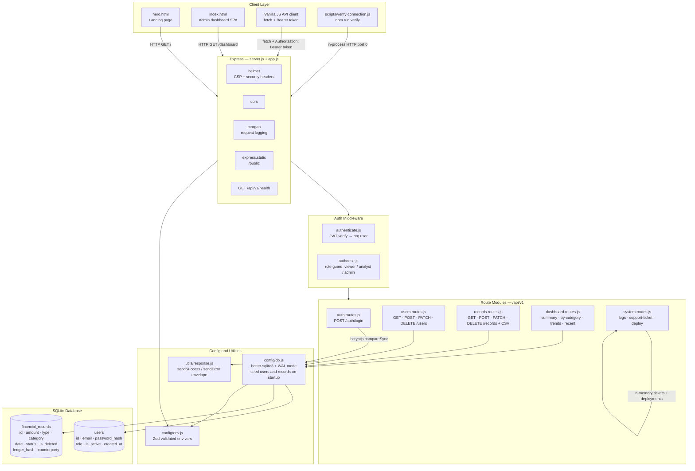

# Kinetic Ledger

Production-style full-stack admin dashboard for financial operations, with secure auth, role-based access, analytics, and operational controls.

## Why This Project

Kinetic Ledger is designed as a focused control plane:

- Secure login with JWT.
- Clear RBAC separation: `viewer`, `analyst`, `admin`.
- Records and analytics in a single operator experience.
- System operations built into the dashboard: support tickets, logs, deploy action.

## Core Capabilities

- Authentication and authorization
   - Login with JWT bearer tokens.
   - Route protection and role guards.
- Financial records
   - Record listing with pagination.
   - Role-aware filters and CSV export.
   - Soft-delete behavior respected by listing APIs.
- Dashboard analytics
   - Summary metrics, category breakdown, trends, recent activity.
- Admin operations
   - User management.
   - Support ticket workflow.
   - System logs view.
   - Deploy Node action (admin-only).
- Frontend experience
   - Hero page at `/`.
   - Admin dashboard at `/dashboard`.
   - Multi-page dashboard navigation (Overview, Records, Analytics, Users, Settings, Support, Logs).

## Tech Stack

- Node.js + Express
- SQLite (`better-sqlite3`)
- JWT (`jsonwebtoken`)
- Validation (`zod`)
- Vanilla HTML/CSS/JS frontend (served by Express)

## Quick Start

```bash
npm install
npm run verify
npm start
```

Open:

- Hero: `http://localhost:3000/`
- Dashboard: `http://localhost:3000/dashboard`

## Seeded Accounts

| Email | Password | Role |
|---|---|---|
| `admin@kinetic.local` | `Admin@123` | admin |
| `analyst@kinetic.local` | `Analyst@123` | analyst |
| `viewer@kinetic.local` | `Viewer@123` | viewer |

---

## Architecture



---

## File Structure

```
kinetic-ledger/
├── .env.example                    # Environment variable template
├── .gitignore
├── package.json                    # Dependencies + npm scripts
├── README.md                       # This file
├── ARCHITECTURE.md                 # Extended architecture + bug fix log
│
├── public/                         # Static frontend served by Express
│   ├── hero.html                   # Landing page
│   ├── index.html                  # Admin dashboard SPA
│   └── favicon.svg
│
├── scripts/
│   ├── verify-connection.js        # npm run verify — smoke tests all endpoints
│   └── audit-functional.js
│
├── src/
│   ├── server.js                   # Entrypoint — app.listen()
│   ├── app.js                      # Express app, middleware chain, route mounting
│   │
│   ├── config/
│   │   ├── env.js                  # Zod env schema + fail-fast validation
│   │   └── db.js                   # SQLite init, schema creation, seed data
│   │
│   ├── middleware/
│   │   ├── authenticate.js         # JWT verify → attaches req.user
│   │   └── authorise.js            # Role-based access guard factory
│   │
│   ├── modules/
│   │   ├── auth/
│   │   │   └── auth.routes.js      # POST /login — bcrypt compare + JWT sign
│   │   ├── users/
│   │   │   └── users.routes.js     # CRUD users (admin-only write paths)
│   │   ├── records/
│   │   │   └── records.routes.js   # Financial records + CSV export
│   │   ├── dashboard/
│   │   │   └── dashboard.routes.js # summary · by-category · trends · recent
│   │   └── system/
│   │       └── system.routes.js    # logs · support-ticket · deploy
│   │
│   └── utils/
│       └── response.js             # { success, data, error, meta } envelope
│
└── data/
    └── kinetic_ledger.db           # SQLite database (WAL mode, gitignored)
```

---

## Request Lifecycle

```
Browser / verify script
        │
        ▼
  Express (app.js)
  ├── helmet       → security headers (CSP, HSTS, X-Frame-Options …)
  ├── cors         → cross-origin policy
  ├── morgan       → dev request logging
  ├── express.json → parse JSON body
  │
  ├── POST /api/v1/auth/login  →  public, no auth required
  │
  └── all other /api/v1/* routes:
        │
        ▼
    authenticate.js
    └── reads Authorization: Bearer <token>
    └── jwt.verify(token, JWT_SECRET) → req.user { id, role, email }
        │
        ▼
    authorise(["admin"]) or authorise(["viewer","analyst","admin"])
    └── checks req.user.role against allowed list
        │
        ▼
    Route handler
    └── Zod input validation (safeParse)
    └── better-sqlite3 prepared statements
    └── sendSuccess / sendError response envelope
```

---

## RBAC Matrix

| Endpoint | viewer | analyst | admin |
|---|---|---|---|
| POST /auth/login | ✓ | ✓ | ✓ |
| GET /users/me | ✓ | ✓ | ✓ |
| GET /users | | | ✓ |
| POST · PATCH · DELETE /users | | | ✓ |
| GET /records (no filters) | ✓ | ✓ | ✓ |
| GET /records (filters / search) | | ✓ | ✓ |
| GET /records?format=csv | | ✓ | ✓ |
| POST · PATCH · DELETE /records | | | ✓ |
| GET /dashboard/summary | ✓ | ✓ | ✓ |
| GET /dashboard/recent | ✓ | ✓ | ✓ |
| GET /dashboard/by-category | | ✓ | ✓ |
| GET /dashboard/trends | | ✓ | ✓ |
| GET /system/logs | | ✓ | ✓ |
| POST /system/support-ticket | ✓ | ✓ | ✓ |
| GET /system/support-ticket | ✓ | ✓ | ✓ |
| POST /system/deploy | | | ✓ |

---

## API Surface

- Auth: `/api/v1/auth/login`
- Users: `/api/v1/users`, `/api/v1/users/me`
- Records: `/api/v1/records`
- Dashboard: `/api/v1/dashboard/summary`, `/api/v1/dashboard/by-category`, `/api/v1/dashboard/trends`, `/api/v1/dashboard/recent`
- System: `/api/v1/system/support-ticket`, `/api/v1/system/logs`, `/api/v1/system/deploy`

Standard API envelope: `{ success, data, error, meta }`.

---

## Verification

`npm run verify` validates:

- Auth login flow
- Dashboard summary endpoint
- Records endpoint
- Dashboard route wiring
- Hero route wiring

---

## Notes

- Inactive users cannot authenticate.
- Viewer role is read-only with restricted filter/query controls.
- System tickets and deployments are stored in-memory (reset on server restart).
- See `ARCHITECTURE.md` for the extended bug fix log and deeper design notes.
